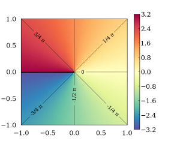
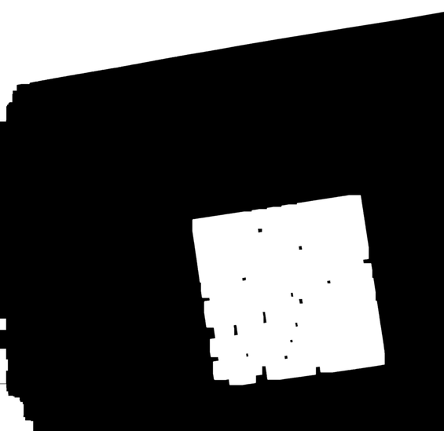
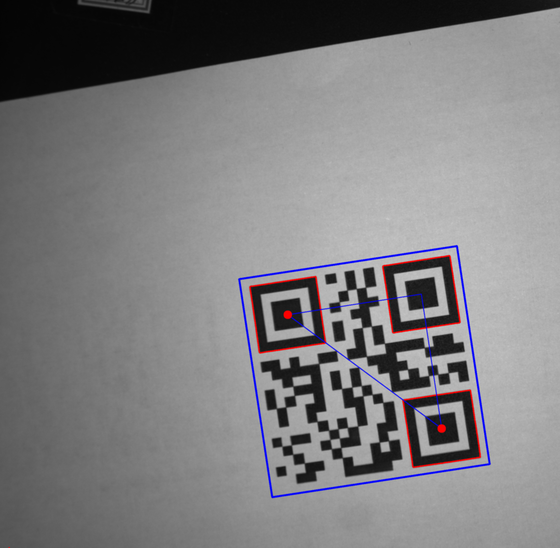

# 二维码扫描

使用zbar进行二维码扫描

## 注意要点

* atan2(y, x)

求反正切

参考：https://zh.cppreference.com/w/cpp/numeric/math/atan2

计算 `y/x` 的弧（反）正切，以参数符号确定正确的象限。

若不出现错误，则返回 `y/x` 在 *[-π ; +π]* 弧度范围中的弧（反）正切（ *arctan(yx)* ）。



需要注意的是，如果使用两个点来进行计算的话，要保证向量一致，这样算出来的角度值域为360。

代码中才用如下的策略来保证：（图中其实第一行第四个图才是二维码摆正后的位置）


设对角线中点为mid，非对角线的第三个定位点为3rd，则：

```
if mid.x > 3rd.x :
	对角线位于一二象限，对角线向量ab = b -a ,即下面的点减去上面的点
else:
	对角线位于三四象限，对角线向量ab = b - a，即上面的点减去下面的点
```

代码：

```c++
// 计算二维码的旋转角度
    float max_distance = 0;
    // 前两个为对角线元素 第一个为y值较小的点 第三个为除对角线点的另一个点
    Point diagPts[3];  

    for (int i = 0; i < contours2.size(); i++)
    {
        float dis = pow(cenPts[i%3].x - cenPts[(i + 1)%3].x, 2) + pow(cenPts[i%3].y - cenPts[(i + 1)%3].y, 2);
        if (dis > max_distance)
        {
            max_distance = dis;
           
            if (cenPts[i % 3].y < cenPts[(i + 1) % 3].y)
            {
                diagPts[0] = cenPts[i % 3];
                diagPts[1] = cenPts[(i + 1) % 3];
            }
            else
            {
                diagPts[1] = cenPts[i % 3];
                diagPts[0] = cenPts[(i + 1) % 3];
            }
            diagPts[2] = cenPts[(i + 2) % 3];
        }
    }
    circle(draw1, diagPts[0], 15, Scalar(0, 0, 255), -1);
    circle(draw1, diagPts[1], 15, Scalar(0, 0, 255), -1);
    Point midPt = Point((diagPts[0].x + diagPts[1].x) / 2, (diagPts[0].y + diagPts[1].y) / 2);
    // theta = 
    float theta = 0;
    // 保证向量起点终点一致
    if (midPt.x > diagPts[2].x)
    {
        // 一二象限
        theta = atan2(diagPts[1].y - diagPts[0].y, diagPts[1].x - diagPts[0].x) * 180 / 3.1415926;
    }
    else
    {
        // 三四象限
        theta = atan2(diagPts[0].y - diagPts[1].y, diagPts[0].x - diagPts[1].x) * 180 / 3.1415926 + 360.0;

    }
    
     // 坐标系转换 y变-y,对于theta = arctan(x)来说，也应该取负 -（theta - 45） 哎呦，看错了标准位置，那再减90°吧
     float angle = - theta  + 45 + 90;
    
    cout << "对角线角度theta（像素坐标系下）:" << theta << endl;
    cout << "需矫正的角度angle：" << angle << endl;
```

除了以对角线其中一个点为原点进行旋转外，也可以使用对角线的中点进行旋转，在此不再尝试。

## 代码逻辑

总体来说分为两步

1. 计算二维码的旋转角度 这一步用于二维码定位纠偏
2. 识别二维码 当二维码旋转45°左右时，zbar很多时候识别不出来二维码内容

处理流程：

|                          原图                          |  |             使用Basler相机拍摄，曝光时间4500              |
| :----------------------------------------------------: | :----------------------------------------------------------: | :-------------------------------------------------------: |
|                       图片预处理                       |  |  根据需要，进行转灰度、~~高斯模糊~~、二值化、膨胀等操作   |
|           提取三个定位块，并计算其形心位置。           |  | 如果（hierarchy [ i ] [2] != -1）说明第i个轮廓存在子轮廓  |
|     计算对角线角度，并从像素坐标系转换到主观坐标系     |  |               计算方法参考上一章：注意要点                |
|                   识别二维码：预处理                   |  |           二值化、膨胀，用于提取二维码的外轮廓            |
|    识别二维码：根据二维码外轮廓点集计算最小包含矩形    |  |     计算得到一个带旋转角度的矩形，用于下面的放射变换      |
| 识别二维码: 将二维码进行仿射变换，把二维码摆正，并提取 |  | 当二维码倾斜45°左右时，将识别不出二维码，所以需要将其摆正 |
|                    识别，并输出结果                    |  |                  将角度和二维码内容输出                   |

